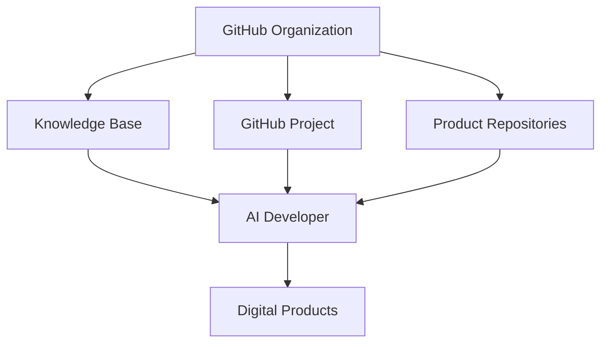

# Engineering Platform Architecture

> [!abstract]
> **Engineering Platform Architecture** — главный архитектурный документ инженерной платформы Sun Decor.
>
> Он описывает устройство инженерной системы организации, взаимосвязь её компонентов и принципы их взаимодействия.
>
> Детальная информация хранится в специализированных документах Knowledge Base и доступна через внутренние ссылки.

---

# Purpose

Инженерная платформа Sun Decor существует для обеспечения **единого, воспроизводимого и масштабируемого процесса разработки цифровых продуктов**.

Платформа объединяет:

- организацию разработки;
- инженерные стандарты;
- процессы;
- архитектурные решения;
- управление знаниями;
- AI-assisted разработку.

Главная цель платформы — обеспечить единый инженерный подход независимо от количества продуктов, участников проекта и используемых технологий.

---

# Engineering Principles

Архитектура платформы основана на следующих принципах.

- Single Source of Truth
- Separation of Concerns
- Documentation as Code
- Process Before Automation
- Knowledge Before Implementation
- Repository per Product
- AI-first Development
- Continuous Improvement

Подробное описание принципов находится в [[Vision/Engineering Principles]].

---

# Engineering Platform Overview



---

# Core Components

## GitHub Organization

Является контейнером всей инженерной деятельности организации.

Подробнее:

[[GitHub/GitHub Organization]]

---

## GitHub Project

Единая система управления инженерной работой.

Отвечает за:

- планирование;
- управление задачами;
- жизненный цикл работы.

Подробнее:

[[GitHub/GitHub Project]]

---

## Knowledge Base

Единый источник инженерных знаний.

Содержит:

- [[ADR]]
- стандарты;
- процессы;
- глоссарий;
- описание продуктов.

---

## Product Repositories

Каждый продукт располагается в собственном репозитории.

Каждый репозиторий имеет единственную ответственность.

Подробнее:

[[Engineering/Repository Standard]]

---

## AI Developer

AI Developer является исполнителем инженерных задач.

Качество результата определяется:

- качеством постановки задачи;
- полнотой инженерного контекста;
- актуальностью инженерной документации.

---

# Repository Architecture

```text
Sun Decor Organization
│
├── .github
│
├── knowledge-base
│
├── landing-page
│
├── ...
│
└── GitHub Project
```

Ответственность компонентов определяется в:

[[ADR-0006]]

---

# Development Lifecycle

Жизненный цикл продукта состоит из следующих этапов.

```text
Idea
    ↓
Discovery
    ↓
Architecture
    ↓
Planning
    ↓
Development
    ↓
Review
    ↓
Release
    ↓
Maintenance
```

Подробное описание процесса находится в:

[[Processes/Engineering Workflow]]

---

# Engineering Information Flow

Инженерная информация проходит следующий путь.

```text
Discussion
      ↓
Discovery
      ↓
Issue
      ↓
GitHub Project
      ↓
Pull Request
      ↓
Release
```

Каждый этап имеет собственную ответственность.

Подробнее:

[[GitHub/Discussion]]

[[GitHub/Issue]]

[[GitHub/GitHub Project]]

[[GitHub/Pull Request]]

[[GitHub/Release]]

---

# Knowledge Flow

Инженерные знания развиваются независимо от разработки продуктов.

```text
Experience
      ↓
Decision
      ↓
ADR
      ↓
Standard
      ↓
Template
      ↓
Engineering Practice
```

Таким образом знания становятся частью инженерной платформы и используются при разработке всех продуктов.

---

# Knowledge Base Structure

```text
README
│
├── Vision
├── ADR
├── Architecture
├── Engineering
├── GitHub
├── Processes
├── Products
├── Glossary
├── Templates
└── Archive
```

Описание структуры находится в:

[[README]]

---

# Product Architecture

Каждый цифровой продукт рассматривается как самостоятельная инженерная единица.

Каждый продукт обладает:

- собственным репозиторием;
- собственной документацией;
- собственным жизненным циклом;
- едиными инженерными стандартами организации.

---

# Continuous Improvement

Инженерная платформа развивается непрерывно.

Любое изменение проходит следующий путь:

```text
Observation
      ↓
Discussion
      ↓
ADR
      ↓
Standards
      ↓
Processes
      ↓
Templates
      ↓
Engineering Practice
```

Таким образом изменения становятся частью инженерной системы, а не отдельных продуктов.

---

# Related Documents

## Architecture

- [[ADR-0001]]
- [[ADR-0002]]
- [[ADR-0003]]
- [[ADR-0004]]
- [[ADR-0005]]
- [[ADR-0006]]
- [[ADR-0007]]
- [[ADR-0008]]
- [[ADR-0009]]
- [[ADR-0010]]
- [[ADR-0011]]
- [[ADR-0012]]
- [[ADR-0013]]
- [[ADR-0014]]

---

## Engineering

- [[Engineering/Definition of Done]]
- [[Engineering/Repository Standard]]

---

## GitHub

- [[GitHub/GitHub Project]]
- [[GitHub/Issue]]
- [[GitHub/Discussion]]
- [[GitHub/Milestone]]
- [[GitHub/Release]]

---

## Processes

- [[Processes/Engineering Workflow]]

---

## Vision

- [[Vision/Engineering Principles]]
- [[Vision/Mission]]
- [[Vision/Vision]]

---

# Navigation

> [!tip]
> Рекомендуемый порядок изучения Knowledge Base:
>
> 1. README
> 2. Engineering Platform Architecture
> 3. ADR
> 4. Engineering Standards
> 5. Processes
> 6. GitHub
> 7. Products
