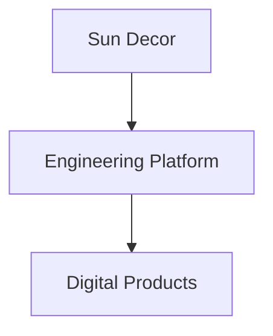
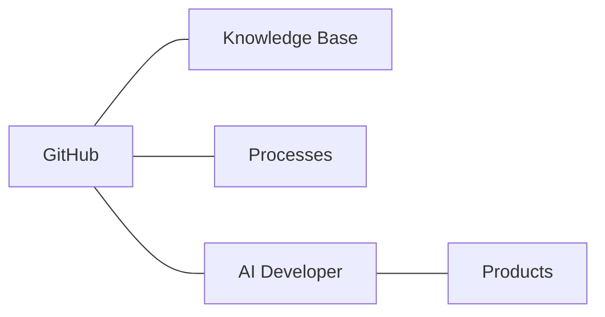

# Engineering Platform Architecture

> [!abstract]
>
> **Engineering Platform Architecture** описывает инженерную платформу Sun Decor с использованием модели [[Engineering Architecture Levels (EAL)]].
>
> Документ является главным архитектурным обзором организации и служит отправной точкой для изучения всей инженерной системы.

---

# Purpose

Инженерная платформа Sun Decor предназначена для создания единой, воспроизводимой и масштабируемой среды разработки цифровых продуктов.

Платформа объединяет процессы, знания, инструменты и инженерные стандарты в единую систему.

Архитектура платформы построена в соответствии с [[ADR-0014]] и использует модель [[ADR-0015]].

---

# Navigation

> [!info]

Рекомендуемый порядок изучения архитектуры:

```text
README
        │
        ▼
Engineering Platform Architecture
        │
        ▼
Engineering Architecture Levels (EAL)
        │
        ▼
Architecture
        │
        ├── GitHub
        ├── Engineering
        ├── Processes
        ├── Products
        └── Standards
```

---

# EAL-1 — Engineering Context

> [!summary]
>
> **Вопрос**
>
> Зачем существует инженерная платформа?

Инженерная платформа является инженерной системой организации Sun Decor.

Она обеспечивает полный жизненный цикл создания цифровых продуктов.



Подробнее:

[[Vision]]

---

# EAL-2 — Engineering Platform

> [!summary]
>
> **Вопрос**
>
> Из каких крупных частей состоит платформа?

Инженерная платформа состоит из пяти основных подсистем.



Подсистемы:

- GitHub
- Knowledge Base
- Engineering Processes
- AI Developer
- Product Repositories

---

# EAL-3 — Engineering Components

> [!summary]
>
> **Вопрос**
>
> Из каких компонентов состоит каждая подсистема?

## GitHub

- Organization
- Repository
- Project
- Issue
- Discussion
- Pull Request
- Actions
- Release

Подробнее:

[[GitHub]]

---

## Knowledge Base

- Vision
- ADR
- Architecture
- Engineering
- GitHub
- Processes
- Products
- Glossary
- Templates
- Archive

Подробнее:

[[README]]

---

## Product Repository

Каждый продукт содержит:

- исходный код;
- документацию;
- Roadmap;
- CHANGELOG;
- Release History.

Подробнее:

[[Repository Standard]]

---

# EAL-4 — Engineering Workflows

> [!summary]
>
> **Вопрос**
>
> Как взаимодействуют компоненты платформы?

Основной процесс разработки:

```text
Idea

↓

Discovery

↓

Planning

↓

Development

↓

Review

↓

Release

↓

Maintenance
```

Подробнее:

[[Engineering Workflow]]

---

Жизненный цикл инженерного знания:

```text
Observation

↓

Decision

↓

ADR

↓

Standard

↓

Template

↓

Engineering Practice
```

Подробнее:

[[ADR]]

---

# EAL-5 — Engineering Practices

> [!summary]
>
> **Вопрос**
>
> Как выполняется инженерная работа?

Инженерная практика определяется:

- инженерными стандартами;
- шаблонами;
- Definition of Done;
- правилами GitHub;
- архитектурными решениями.

Практики являются конечным уровнем детализации инженерной платформы.

Подробнее:

[[Engineering]]

---

# Architecture Principles

Архитектура платформы основана на следующих принципах.

- Single Source of Truth
- Separation of Concerns
- Process Before Automation
- Knowledge Before Implementation
- Documentation as Code
- Repository per Product
- AI-first Development

Подробнее:

[[Engineering Principles]]

---

# Related Documents

## Architecture

- [[Engineering Architecture Levels (EAL)]]
- [[ADR-0014]]
- [[ADR-0015]]

---

## Processes

- [[Engineering Workflow]]

---

## GitHub

- [[GitHub]]

---

## Engineering

- [[Engineering]]

---

## Knowledge Base

- [[README]]