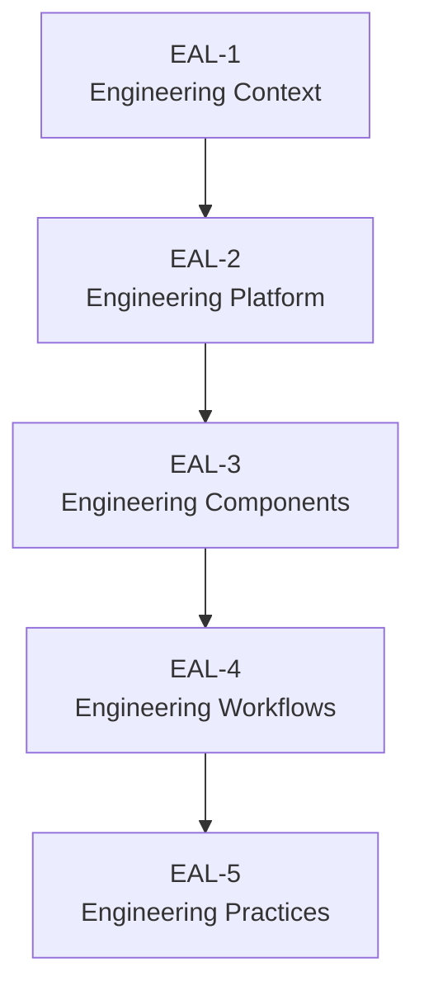

# Engineering Architecture Levels (EAL)

> [!abstract]
> **Engineering Architecture Levels (EAL)** — архитектурная модель, используемая для описания инженерной платформы Sun Decor.
>
> Модель определяет последовательные уровни абстракции, позволяющие описывать инженерную систему от её назначения до конкретных инженерных практик.
>
> EAL используется как основа для построения всех архитектурных документов Knowledge Base.

---

# Purpose

Engineering Architecture Levels предоставляет единый способ описания инженерной платформы организации.

Модель позволяет:

- постепенно переходить от общего представления системы к деталям;
- разделять архитектурную документацию по уровням ответственности;
- уменьшать связность документов;
- исключать дублирование информации;
- обеспечивать единый подход к проектированию инженерной платформы.

Использование модели EAL утверждено в [[ADR-0015]].

---

# Design Principles

При использовании модели EAL применяются следующие принципы.

## One Level — One Responsibility

Каждый уровень отвечает только на один круг архитектурных вопросов.

Информация не должна дублироваться между уровнями.

---

## Top Down

Описание инженерной платформы выполняется сверху вниз.

От общего контекста — к деталям реализации.

---

## Progressive Disclosure

Каждый следующий уровень раскрывает детали предыдущего.

Документы не повторяют информацию, а уточняют её.

---

## Single Source of Truth

Каждая архитектурная сущность описывается только в одном месте.

Другие документы используют ссылки `[[Wiki Links]]`.

---

# Architecture Levels

## EAL-1 — Engineering Context

> [!summary]
> **Вопрос:** *Зачем существует инженерная платформа и в каком окружении она работает?*

Первый уровень определяет внешний контекст инженерной платформы.

На этом уровне рассматриваются:

- организация;
- инженерная платформа;
- цифровые продукты;
- заинтересованные стороны;
- внешние системы.

Не рассматриваются внутренние компоненты платформы.

### Основной результат

Понимание роли инженерной платформы в организации.

---

## EAL-2 — Engineering Platform

> [!summary]
> **Вопрос:** *Из каких крупных частей состоит инженерная платформа?*

На этом уровне описываются основные подсистемы платформы.

Например:

- GitHub Organization;
- GitHub Projects;
- Knowledge Base;
- Product Repositories;
- AI Developer.

Каждая подсистема рассматривается как самостоятельный архитектурный компонент.

### Основной результат

Понимание состава инженерной платформы.

---

## EAL-3 — Engineering Components

> [!summary]
> **Вопрос:** *Из каких компонентов состоит каждая подсистема?*

На данном уровне раскрываются внутренние компоненты платформы.

Например:

GitHub:

- Organization
- Repository
- Project
- Issue
- Discussion
- Pull Request
- Actions
- Release

Knowledge Base:

- ADR
- Standards
- Processes
- Templates
- Products
- Glossary

### Основной результат

Понимание структуры инженерной платформы.

---

## EAL-4 — Engineering Workflows

> [!summary]
> **Вопрос:** *Как взаимодействуют компоненты платформы?*

На данном уровне описываются инженерные процессы.

Например:

- жизненный цикл задачи;
- жизненный цикл продукта;
- жизненный цикл знаний;
- процесс выпуска релизов;
- процесс принятия архитектурных решений.

### Основной результат

Понимание взаимодействия компонентов платформы.

---

## EAL-5 — Engineering Practices

> [!summary]
> **Вопрос:** *Как выполняются конкретные инженерные действия?*

Последний уровень содержит прикладные инженерные практики.

Например:

- создание Issue;
- оформление ADR;
- проведение Code Review;
- подготовка Release;
- использование GitHub Project;
- применение шаблонов.

### Основной результат

Понимание конкретных инженерных действий.

---

# Architecture Hierarchy

```text
Engineering Context
        │
        ▼
Engineering Platform
        │
        ▼
Engineering Components
        │
        ▼
Engineering Workflows
        │
        ▼
Engineering Practices
```

Каждый уровень раскрывает детали предыдущего и не нарушает его границы ответственности.

---

# Relationship Between Levels



---

# Document Mapping

Документы Knowledge Base должны соответствовать определённому уровню EAL.

| Уровень | Тип документов | Примеры |
|----------|----------------|----------|
| EAL-1 | Архитектурный обзор | [[Engineering Platform Architecture]] |
| EAL-2 | Архитектура платформы | GitHub Platform, Knowledge Base |
| EAL-3 | Архитектура компонентов | Repository, GitHub Project, ADR |
| EAL-4 | Процессы | Engineering Workflow, Release Process |
| EAL-5 | Практики | Definition of Done, Repository Standard |

---

# Navigation

```text
README
        │
        ▼
Engineering Platform Architecture
        │
        ▼
Engineering Architecture Levels
        │
        ▼
Architecture
        │
        ├── GitHub
        ├── Engineering
        ├── Processes
        ├── Products
        └── Standards
```

---

# Related Documents

## Architecture

- [[ADR-0014]]
- [[ADR-0015]]
- [[Engineering Platform Architecture]]

---

## Standards

- [[Documentation Standard]]

---

## Processes

- [[Engineering Workflow]]

---

# Notes

Engineering Architecture Levels определяет архитектурную модель описания инженерной платформы.

Модель не описывает конкретную реализацию процессов, компонентов или продуктов.

Любое изменение состава уровней, их ответственности или взаимосвязей рассматривается как изменение архитектуры инженерной платформы и оформляется отдельным ADR.