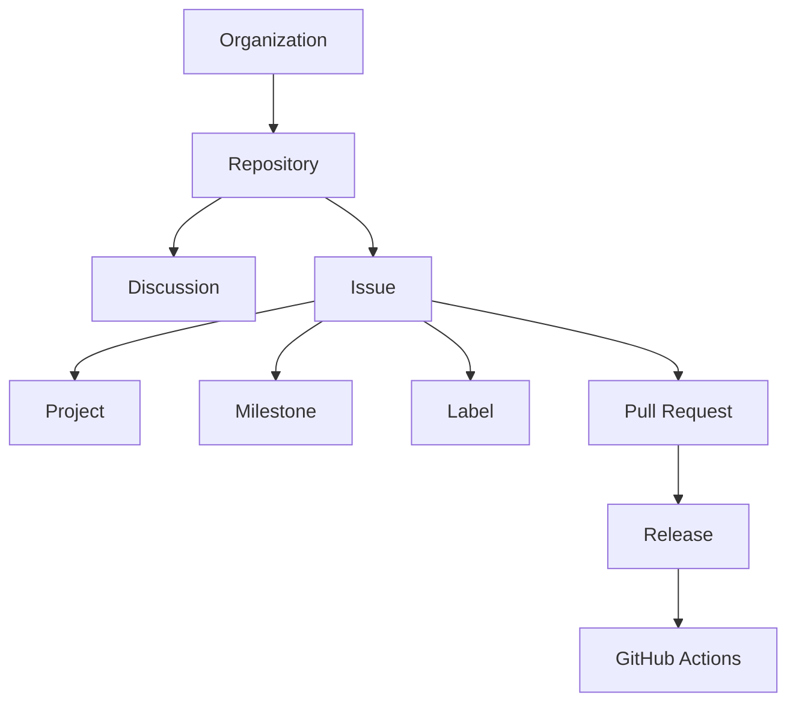

# GitHub Ecosystem

> [!abstract]
> **GitHub Ecosystem** описывает роль GitHub в инженерной платформе Sun Decor.
>
> Документ определяет основные сущности GitHub, их ответственность и взаимосвязи в контексте инженерной системы организации.
>
> Описание построено с использованием модели [[Engineering Architecture Levels (EAL)]] и служит отправной точкой для изучения всех документов раздела `Engineering/GitHub`.

---

# Purpose

GitHub является основной инженерной платформой Sun Decor.

Он предоставляет единое пространство для:

- управления репозиториями;
- совместной работы;
- управления инженерными задачами;
- документирования решений;
- автоматизации процессов;
- публикации цифровых продуктов.

GitHub рассматривается не как набор отдельных сервисов, а как взаимосвязанная инженерная экосистема.

---

# Scope

Настоящий документ описывает:

- инженерные сущности GitHub;
- ответственность каждой сущности;
- взаимосвязи между сущностями;
- место GitHub в инженерной платформе Sun Decor.

Документ **не** содержит инструкций по использованию GitHub.

Практические рекомендации и стандарты описываются в отдельных документах Knowledge Base.

---

# EAL-1 — GitHub Context

> [!summary]
> **Вопрос:** Какую роль GitHub выполняет в инженерной платформе?

GitHub является основной платформой реализации инженерной деятельности.

Он объединяет:

- организацию разработки;
- управление продуктами;
- управление инженерной работой;
- публикацию результатов;
- автоматизацию повторяемых процессов.

GitHub не определяет инженерные процессы.

Он реализует процессы, принятые организацией.

---

# EAL-2 — GitHub Core Domains

> [!summary]
> **Вопрос:** Из каких крупных доменов состоит GitHub в рамках инженерной платформы?

Инженерная модель GitHub состоит из следующих доменов.

```text
GitHub

├── Organization
├── Repository
├── Collaboration
├── Planning
├── Delivery
└── Automation
```

---

## Organization

Отвечает за организационную структуру инженерной платформы.

Основная сущность:

- [[GitHub Organization]]

---

## Repository

Отвечает за хранение инженерных артефактов и исходного кода продуктов.

Основная сущность:

- [[Repository]]

---

## Collaboration

Отвечает за совместную инженерную работу.

Основные сущности:

- [[Discussion]]
- [[Issue]]
- [[Pull Request]]

---

## Planning

Отвечает за управление инженерной деятельностью.

Основные сущности:

- [[Project]]
- [[Milestone]]
- [[Label]]

---

## Delivery

Отвечает за публикацию результатов разработки.

Основные сущности:

- [[Release]]

---

## Automation

Отвечает за автоматизацию инженерных процессов.

Основная сущность:

- [[GitHub Actions]]

---

# EAL-3 — Engineering Entities

> [!summary]
> **Вопрос:** Какие инженерные сущности образуют экосистему GitHub?



Каждая сущность обладает собственной зоной ответственности и не должна использоваться для решения задач, относящихся к другим сущностям.

---

# Engineering Responsibilities

| Сущность | Основная ответственность | Не отвечает за |
|----------|--------------------------|----------------|
| Organization | Управление инженерной организацией | Разработку продукта |
| Repository | Хранение продукта | Управление задачами |
| Discussion | Исследование и обсуждение | Планирование выполнения |
| Issue | Формализация инженерной работы | Долгосрочное планирование |
| Project | Управление выполнением | Хранение инженерных артефактов |
| Milestone | Группировка работы по этапам | Управление состояниями задач |
| Label | Классификация | Управление жизненным циклом |
| Pull Request | Интеграция изменений | Управление проектом |
| Release | Поставка результата | Разработка функциональности |
| GitHub Actions | Автоматизация процессов | Определение инженерной методологии |

---

# EAL-4 — Engineering Workflow

> [!summary]
> **Вопрос:** Как инженерная работа проходит через экосистему GitHub?

```text
Idea
    ↓
Discussion
    ↓
Discovery
    ↓
Issue
    ↓
Project
    ↓
Pull Request
    ↓
Release
```

GitHub предоставляет необходимые сущности для реализации жизненного цикла инженерной работы.

Сам жизненный цикл определяется документом [[Engineering Workflow]].

---

# EAL-5 — Engineering Practices

> [!summary]
> **Вопрос:** Как используются сущности GitHub в инженерной практике?

Для каждой сущности GitHub существует отдельный документ Knowledge Base, определяющий:

- назначение;
- ответственность;
- правила использования;
- взаимосвязи;
- ограничения;
- ссылки на связанные инженерные процессы.

---

# Design Principles

Экосистема GitHub используется в соответствии со следующими принципами.

- Single Source of Truth
- Repository per Product
- Process Before Automation
- Separation of Concerns
- Documentation as Code
- Knowledge Before Implementation

Подробнее:

- [[Engineering Principles]]
- [[ADR-0006]]
- [[ADR-0014]]
- [[ADR-0015]]

---

# Related Documents

## GitHub

- [[GitHub Organization]]
- [[Repository]]
- [[Discussion]]
- [[Issue]]
- [[Project]]
- [[Milestone]]
- [[Label]]
- [[Pull Request]]
- [[Release]]
- [[GitHub Actions]]

---

## Architecture

- [[Engineering Platform Architecture]]
- [[Engineering Architecture Levels (EAL)]]

---

## Processes

- [[Engineering Workflow]]

---

# Navigation

> [!tip]
> Рекомендуемый порядок изучения раздела `Engineering/GitHub`:
>
> 1. GitHub Ecosystem
> 2. GitHub Organization
> 3. Repository
> 4. Discussion
> 5. Issue
> 6. Project
> 7. Milestone
> 8. Label
> 9. Pull Request
> 10. Release
> 11. GitHub Actions
