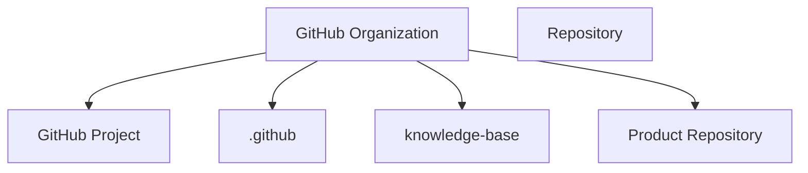

# GitHub Organization

> [!abstract]
> **GitHub Organization** — корневая доменная сущность инженерной платформы Sun Decor.
>
> Организация определяет границы инженерной системы и объединяет все инженерные артефакты: репозитории, проекты, команды, процессы и стандарты.
>
> Все остальные сущности GitHub существуют только в контексте организации.

---

# Purpose

GitHub Organization существует для объединения инженерной деятельности в едином пространстве.

Организация обеспечивает:

- единое владение инженерными активами;
- централизованное управление репозиториями;
- единые стандарты разработки;
- единые инженерные процессы;
- единое пространство управления продуктами.

Организация является верхним уровнем инженерной платформы.

---

# Responsibilities

GitHub Organization отвечает за:

- хранение репозиториев организации;
- управление инженерной платформой;
- публикацию открытых продуктов;
- хранение общих инженерных ресурсов;
- управление доступом участников;
- централизованное использование GitHub Projects;
- применение единых инженерных стандартов.

---

# Non-Responsibilities

GitHub Organization **не отвечает** за:

- разработку отдельных продуктов;
- хранение бизнес-логики;
- управление жизненным циклом задач;
- реализацию функциональности продуктов;
- описание инженерных процессов.

Эти обязанности принадлежат соответствующим доменным сущностям.

---

# Lifecycle

```text
Создание организации
        ↓
Настройка инженерной платформы
        ↓
Создание общих репозиториев
        ↓
Создание продуктовых репозиториев
        ↓
Развитие инженерной экосистемы
```

Организация создаётся один раз и развивается непрерывно.

Её жизненный цикл не зависит от жизненного цикла отдельных продуктов.

---

# Relationships



GitHub Organization является владельцем всех инженерных ресурсов.

---

# Engineering Rules

## Organization First

Каждый инженерный артефакт создаётся внутри организации.

Создание продуктовых репозиториев в личных аккаунтах не допускается.

---

## Shared Engineering Platform

Организация предоставляет единую инженерную платформу для всех продуктов.

Общие процессы и стандарты не дублируются между репозиториями.

---

## Single Source of Truth

Организация является единственным владельцем инженерных артефактов.

Все официальные репозитории располагаются только внутри GitHub Organization.

---

## Product Isolation

Каждый цифровой продукт развивается в собственном репозитории.

Организация объединяет продукты, но не смешивает их.

---

## Engineering Before Products

Сначала развивается инженерная платформа.

Затем создаются продукты, использующие её возможности.

---

# Constraints

GitHub Organization имеет следующие ограничения.

- Каждый репозиторий принадлежит только одной организации.
- Репозиторий не может одновременно принадлежать нескольким организациям.
- Все общие инженерные ресурсы должны храниться внутри организации.
- Организация является единственной точкой управления инженерной платформой.

---

# Best Practices

Рекомендуется:

- использовать организацию как единую точку входа для всей инженерной деятельности;
- хранить общие стандарты в `knowledge-base`;
- хранить общие шаблоны в `.github`;
- создавать отдельный репозиторий для каждого продукта;
- использовать единый GitHub Project для управления инженерной деятельностью организации;
- поддерживать единый жизненный цикл разработки для всех продуктов.

---

# Architecture Notes

В инженерной платформе Sun Decor GitHub Organization рассматривается как **корневой контейнер инженерной системы**.

Она определяет границы платформы и объединяет все остальные доменные сущности GitHub.

Таким образом, организация является фундаментом инженерной архитектуры и отправной точкой для построения процессов разработки.

---

# Related Documents

## Overview

- [[GitHub Ecosystem]]

---

## Related Entities

- [[Repository]]
- [[Project]]
- [[Discussion]]
- [[Issue]]
- [[Milestone]]
- [[Label]]
- [[Pull Request]]
- [[Release]]
- [[GitHub Actions]]

---

## Architecture

- [[Engineering Platform Architecture]]
- [[Engineering Architecture Levels (EAL)]]

---

## Architecture Decision Records

- [[ADR-0006]]
- [[ADR-0014]]
- [[ADR-0015]]