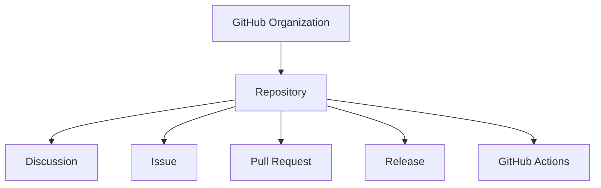

# Repository

> [!abstract]
> **Repository** — доменная сущность инженерной платформы Sun Decor, представляющая собой самостоятельный инженерный продукт.
>
> Репозиторий объединяет все артефакты, необходимые для полного жизненного цикла продукта: исходный код, документацию, процессы разработки, историю изменений и результаты поставки.
>
> В инженерной платформе Sun Decor действует принцип **One Product — One Repository**.

---

# Purpose

Repository существует для управления жизненным циклом одного продукта.

Он обеспечивает единое место хранения всех инженерных артефактов, связанных с продуктом, и служит его единственным официальным источником.

Каждый репозиторий обладает собственной историей, документацией, релизами и процессом разработки.

---

# Responsibilities

Repository отвечает за:

- хранение исходного кода продукта;
- хранение документации продукта;
- хранение конфигурации продукта;
- управление историей изменений;
- публикацию релизов;
- ведение журнала изменений;
- интеграцию с инженерной платформой;
- использование общих инженерных стандартов организации.

---

# Non-Responsibilities

Repository **не отвечает** за:

- управление инженерной организацией;
- хранение общих инженерных стандартов;
- управление всеми задачами организации;
- описание архитектуры инженерной платформы;
- принятие архитектурных решений организации.

Эти обязанности относятся к другим доменным сущностям.

---

# Lifecycle

```text
Создание репозитория
        ↓
Инициализация структуры
        ↓
Настройка инженерной инфраструктуры
        ↓
Разработка продукта
        ↓
Публикация релизов
        ↓
Сопровождение
        ↓
Архивирование
```

Жизненный цикл репозитория соответствует жизненному циклу продукта.

---

# Relationships



Repository является центральным контейнером инженерной работы над конкретным продуктом.

---

# Engineering Rules

## One Product — One Repository

Каждый продукт размещается в отдельном репозитории.

Один репозиторий соответствует одному продукту.

---

## Repository as Product

Репозиторий рассматривается как инженерное представление продукта, а не только как хранилище исходного кода.

---

## Documentation First

Каждый репозиторий содержит документацию, необходимую для понимания, разработки и сопровождения продукта.

---

## Standardized Structure

Все продуктовые репозитории используют единую структуру каталогов и единый набор обязательных документов.

---

## Independent Lifecycle

Каждый репозиторий развивается независимо от остальных продуктов.

Версионирование, релизы и планирование выполняются отдельно для каждого продукта.

---

# Constraints

Для каждого репозитория действуют следующие ограничения.

- Один репозиторий представляет только один продукт.
- Репозиторий принадлежит одной GitHub Organization.
- Каждый репозиторий использует общие инженерные стандарты организации.
- Репозиторий не должен содержать несколько независимых продуктов.
- Общие инженерные знания не дублируются внутри продуктовых репозиториев.

---

# Best Practices

Рекомендуется:

- создавать репозиторий только после завершения этапа Discovery;
- использовать единый шаблон структуры репозитория;
- хранить документацию рядом с продуктом;
- публиковать релизы через механизм GitHub Releases;
- использовать GitHub Project организации для управления инженерной работой;
- поддерживать актуальный README;
- сопровождать каждое изменение соответствующим Issue.

---

# Repository Structure

Каждый продуктовый репозиторий должен включать:

```text
Repository

├── .github/
├── docs/
├── assets/
├── src/
├── README.md
├── CHANGELOG.md
├── ROADMAP.md
├── LICENSE
└── CONTRIBUTING.md
```

Конкретная структура может расширяться в зависимости от типа продукта, однако должна соответствовать инженерным стандартам организации.

---

# Architecture Notes

Repository является основной единицей разработки в инженерной платформе Sun Decor.

Все инженерные процессы — обсуждения, задачи, изменения, релизы и автоматизация — выполняются в контексте конкретного репозитория.

Инженерная платформа предоставляет общие правила, а репозиторий реализует их применительно к отдельному продукту.

---

# Related Documents

## Overview

- [[GitHub Ecosystem]]

---

## Related Entities

- [[GitHub Organization]]
- [[Discussion]]
- [[Issue]]
- [[Project]]
- [[Milestone]]
- [[Label]]
- [[Pull Request]]
- [[Release]]
- [[GitHub Actions]]

---

## Architecture

- [[Engineering Platform Architecture]]
- [[Engineering Architecture Levels (EAL)]]

---

## Standards

- [[Repository Standard]]
- [[Engineering Principles]]

---

## Architecture Decision Records

- [[ADR-0006]]
- [[ADR-0014]]
- [[ADR-0015]]