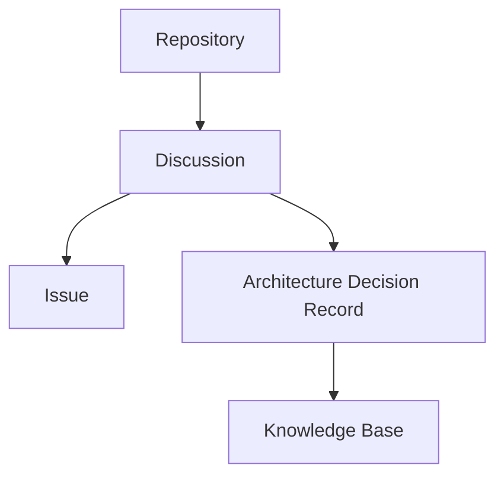

# Discussion

> [!abstract]
> **Discussion** — доменная сущность инженерной платформы Sun Decor, предназначенная для исследования, обсуждения и формирования инженерных знаний.
>
> Discussion является отправной точкой жизненного цикла инженерной идеи. Здесь анализируются проблемы, формулируются гипотезы, рассматриваются альтернативы и принимаются решения о необходимости дальнейшей работы.
>
> Discussion не является задачей на выполнение. Её результатом может стать создание Issue, подготовка ADR, обновление документации или отказ от дальнейших действий.

---

# Purpose

Discussion существует для того, чтобы отделить исследование проблемы от её реализации.

Она обеспечивает пространство для:

- фиксации наблюдений и идей;
- совместного обсуждения;
- анализа требований;
- оценки рисков;
- рассмотрения альтернатив;
- формирования инженерного решения.

Discussion позволяет принимать решения до начала разработки.

---

# Responsibilities

Discussion отвечает за:

- исследование инженерной проблемы;
- сбор контекста;
- обсуждение возможных решений;
- документирование аргументов;
- достижение инженерного консенсуса;
- принятие решения о дальнейших действиях.

---

# Non-Responsibilities

Discussion **не отвечает** за:

- выполнение инженерной работы;
- планирование разработки;
- отслеживание выполнения задач;
- управление релизами;
- хранение исходного кода;
- проведение Code Review.

Если принято решение о реализации, создаётся [[Issue]].

---

# Lifecycle

```text
Observation
        ↓
Idea
        ↓
Discussion Created
        ↓
Research
        ↓
Decision
        ↓
───────────────┬───────────────────────┬───────────────────────
               │                       │
               ▼                       ▼
        Create Issue             Create ADR
               │                       │
               └───────────────┬───────┘
                               ▼
                    Update Knowledge Base
```

Discussion завершается принятием решения, а не выполнением работы.

---

# Relationships



Discussion связывает идеи, инженерные решения и дальнейшую реализацию.

---

# Engineering Rules

## Discussion Before Issue

Любая значимая инженерная работа начинается с Discussion.

Issue создаётся только после принятия решения о необходимости реализации.

---

## Knowledge Before Implementation

Главная цель Discussion — получить знания, достаточные для принятия инженерного решения.

---

## Multiple Outcomes

Discussion не обязана завершаться созданием Issue.

Допустимые результаты:

- создание Issue;
- создание ADR;
- обновление документации;
- отклонение идеи;
- перенос обсуждения.

---

## Open Discussion

Discussion должна содержать аргументы, альтернативы и выводы.

Она не должна превращаться в список задач.

---

## Decision Driven

Каждая Discussion должна завершиться явным решением.

Если решение отсутствует, Discussion остаётся открытой.

---

# Constraints

Discussion имеет следующие ограничения.

- Discussion не используется для управления выполнением работы.
- Discussion не заменяет Issue.
- Discussion не заменяет ADR.
- Одна Discussion может привести к нескольким Issue.
- Один Issue должен иметь понятный источник возникновения (Discussion или ADR).

---

# Best Practices

Рекомендуется:

- создавать Discussion при появлении новой идеи или проблемы;
- описывать контекст, а не только предполагаемое решение;
- фиксировать альтернативные варианты;
- явно документировать принятое решение;
- ссылаться на связанные ADR, если они были приняты;
- создавать Issue только после завершения исследования.

---

# Categories

В инженерной платформе Sun Decor рекомендуется использовать следующие категории Discussion.

| Категория | Назначение |
|-----------|------------|
| Idea | Новые идеи и предложения |
| Question | Вопросы, требующие обсуждения |
| Discovery | Исследование проблемы или возможностей |
| Architecture | Архитектурные обсуждения |
| Product | Обсуждение функциональности продукта |
| Engineering | Развитие инженерной платформы |

---

# Architecture Notes

Discussion является первой инженерной сущностью жизненного цикла разработки.

Она отделяет этап исследования от этапа реализации и обеспечивает принцип **Knowledge Before Implementation**.

В инженерной платформе Sun Decor Discussion рассматривается как источник инженерного знания, а не как средство управления задачами.

---

# Related Documents

## Overview

- [[GitHub Ecosystem]]

---

## Related Entities

- [[GitHub Organization]]
- [[Repository]]
- [[Issue]]
- [[Project]]
- [[Pull Request]]

---

## Architecture

- [[Engineering Platform Architecture]]
- [[Engineering Architecture Levels (EAL)]]

---

## Processes

- [[Engineering Workflow]]

---

## Architecture Decision Records

- [[ADR-0014]]
- [[ADR-0015]]
- [[ADR-0016]]