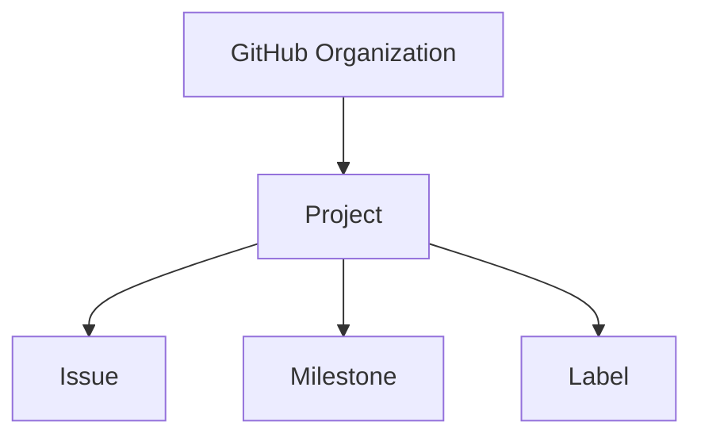

# Project

> [!abstract]
> **Project** — доменная сущность инженерной платформы Sun Decor, предназначенная для организации, планирования и управления инженерной работой.
>
> Project не является хранилищем инженерных задач. Он объединяет существующие сущности (например, Issue) в единый управляемый процесс, определяя их жизненный цикл, приоритеты, классификацию и представления.
>
> В инженерной платформе Sun Decor Project рассматривается как система управления работой, а не как источник работы.

---

# Purpose

Project существует для управления инженерной деятельностью.

Он обеспечивает единое пространство, в котором инженерная работа:

- планируется;
- приоритизируется;
- отслеживается;
- проходит жизненный цикл;
- становится прозрачной для всех участников.

Project объединяет инженерные сущности в управляемый процесс без изменения их содержания.

---

# Responsibilities

Project отвечает за:

- организацию инженерной работы;
- управление жизненным циклом задач;
- определение статусов выполнения;
- визуализацию текущего состояния работы;
- управление представлениями (Views);
- использование полей (Fields);
- применение автоматизации рабочего процесса;
- обеспечение прозрачности инженерной деятельности.

---

# Non-Responsibilities

Project **не отвечает** за:

- хранение инженерных знаний;
- создание исходного кода;
- разработку функциональности;
- проведение инженерных обсуждений;
- принятие архитектурных решений;
- публикацию релизов.

Project управляет инженерной работой, но не выполняет её.

---

# Lifecycle

```text
Создание Project
        ↓
Настройка структуры управления
        ↓
Определение полей и представлений
        ↓
Добавление инженерной работы
        ↓
Управление жизненным циклом
        ↓
Непрерывное сопровождение
```

Project создаётся до появления инженерных задач и существует независимо от количества содержащихся в нём элементов.

---

# Relationships



Project организует инженерную работу, связывая задачи с механизмами планирования и классификации.

---

# Engineering Rules

## Project Before Work

Project создаётся до начала инженерной деятельности и определяет правила управления работой.

---

## Project Does Not Own Issues

Issue существуют независимо от Project.

Project лишь включает их в процесс управления.

---

## Single Management Space

Для инженерной платформы Sun Decor используется единый организационный Project для управления всей инженерной деятельностью.

При необходимости отдельные продукты могут использовать собственные Projects, если это обосновано архитектурными или организационными требованиями.

---

## Workflow Driven

Жизненный цикл работы определяется настройками Project.

Статусы отражают этапы инженерного процесса, а не тип задачи.

---

## Visibility First

Project должен обеспечивать прозрачность текущего состояния инженерной деятельности для всех участников.

---

# Constraints

Project имеет следующие ограничения.

- Project не является хранилищем инженерных знаний.
- Project не заменяет Repository.
- Project не заменяет Issue.
- Project не определяет инженерную методологию — он реализует её.
- Один Issue может одновременно участвовать в нескольких Projects, если это соответствует инженерному процессу.

---

# Best Practices

Рекомендуется:

- использовать один организационный Project как единую точку управления инженерной деятельностью;
- применять единый жизненный цикл задач;
- использовать представления (Views) для разных ролей и сценариев работы;
- минимизировать количество пользовательских полей;
- автоматизировать только повторяющиеся действия;
- регулярно актуализировать состояние задач.

---

# Core Components

В инженерной платформе Sun Decor Project состоит из следующих основных компонентов.

| Компонент | Назначение |
|-----------|------------|
| Status | Отражает жизненный цикл инженерной работы |
| Views | Представляют различные способы отображения работы |
| Fields | Хранят дополнительные инженерные атрибуты |
| Work Items | Ссылки на управляемые сущности (Issue и др.) |
| Automation | Автоматизирует повторяющиеся операции |

---

# Architecture Notes

Project является центральной сущностью управления инженерной деятельностью.

Он отделяет управление работой от самой работы, реализуя принцип **Separation of Concerns**.

В инженерной платформе Sun Decor Project рассматривается как механизм реализации инженерного Workflow.

---

# Related Documents

## Overview

- [[GitHub Ecosystem]]

---

## Related Entities

- [[GitHub Organization]]
- [[Repository]]
- [[Discussion]]
- [[Issue]]
- [[Milestone]]
- [[Label]]
- [[Pull Request]]

---

## Processes

- [[Engineering Workflow]]

---

## Architecture

- [[Engineering Platform Architecture]]
- [[Engineering Architecture Levels (EAL)]]

---

## Architecture Decision Records

- [[ADR-0014]]
- [[ADR-0015]]
- [[ADR-0016]]