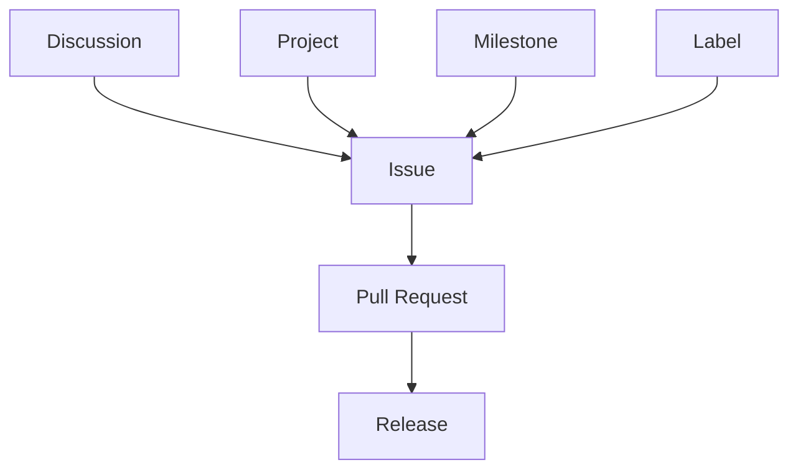

# Issue

> [!abstract]
> **Issue** — доменная сущность инженерной платформы Sun Decor, представляющая собой формализованное инженерное обязательство выполнить согласованную работу.
>
> Issue возникает после завершения этапа исследования и принятия решения о необходимости реализации. Он определяет конкретный объём инженерной работы и служит единицей планирования, исполнения и контроля.
>
> В инженерной платформе Sun Decor Issue является основной единицей инженерной работы.

---

# Purpose

Issue существует для формализации инженерной работы.

Он переводит результаты исследования и принятых решений в управляемую инженерную деятельность.

Каждый Issue описывает одну самостоятельную единицу работы с чётко определённой целью, границами и ожидаемым результатом.

---

# Responsibilities

Issue отвечает за:

- описание инженерной работы;
- фиксацию цели выполнения;
- определение ожидаемого результата;
- хранение контекста реализации;
- участие в инженерном Workflow;
- отслеживание выполнения;
- связь инженерной работы с другими сущностями платформы.

---

# Non-Responsibilities

Issue **не отвечает** за:

- исследование проблемы;
- обсуждение альтернатив;
- принятие архитектурных решений;
- управление жизненным циклом проекта;
- публикацию релизов;
- хранение исходного кода.

Эти обязанности принадлежат другим доменным сущностям.

---

# Lifecycle

```text
Discussion
        ↓
Engineering Decision
        ↓
Issue Created
        ↓
Added to Project
        ↓
Execution
        ↓
Review
        ↓
Completed
        ↓
Released
```

Issue создаётся только после принятия инженерного решения о необходимости выполнения работы.

---

# Relationships



Issue связывает этап исследования с этапом реализации.

---

# Engineering Rules

## Discussion Before Issue

Issue создаётся после завершения Discussion либо на основании ранее принятого архитектурного решения.

---

## One Engineering Goal

Каждый Issue должен иметь одну инженерную цель.

Если работа содержит несколько независимых целей, она разделяется на несколько Issue.

---

## Clear Completion Criteria

Для каждого Issue должны быть определены критерии завершения.

Работа считается выполненной только после достижения этих критериев.

---

## Traceability

Issue должен иметь ссылки на источник возникновения:

- Discussion;
- ADR;
- Product Requirement;
- другую инженерную документацию.

---

## Work Before Code

Создание исходного кода является следствием существования Issue, а не наоборот.

---

# Constraints

Issue имеет следующие ограничения.

- Один Issue описывает одну инженерную работу.
- Issue не используется для обсуждений.
- Issue не заменяет Project.
- Issue не заменяет Pull Request.
- Issue не должен объединять несколько независимых инженерных задач.

---

# Best Practices

Рекомендуется:

- создавать Issue только после завершения исследования;
- использовать единый шаблон оформления;
- явно формулировать ожидаемый результат;
- определять критерии готовности (Definition of Done);
- связывать Issue с соответствующим Project;
- использовать Label и Milestone для классификации и планирования;
- сопровождать реализацию ссылкой на Pull Request.

---

# Issue Structure

Каждый Issue рекомендуется оформлять по следующей структуре.

| Раздел | Назначение |
|---------|------------|
| Summary | Краткое описание инженерной работы |
| Background | Контекст возникновения |
| Goal | Цель выполнения |
| Scope | Границы работы |
| Acceptance Criteria | Критерии завершения |
| References | Связанные документы и сущности |

---

# Architecture Notes

Issue является основной единицей инженерной работы.

Он отделяет принятие решения от выполнения, обеспечивая прослеживаемость полного жизненного цикла инженерной деятельности.

Каждый Issue должен иметь понятное происхождение, чёткие границы ответственности и измеримый результат.

---

# Related Documents

## Overview

- [[GitHub Ecosystem]]

---

## Related Entities

- [[GitHub Organization]]
- [[Repository]]
- [[Discussion]]
- [[Project]]
- [[Milestone]]
- [[Label]]
- [[Pull Request]]
- [[Release]]

---

## Processes

- [[Engineering Workflow]]

---

## Architecture

- [[Engineering Platform Architecture]]
- [[Engineering Architecture Levels (EAL)]]

---

## Architecture Decision Records

- [[ADR-0014]]
- [[ADR-0015]]
- [[ADR-0016]]