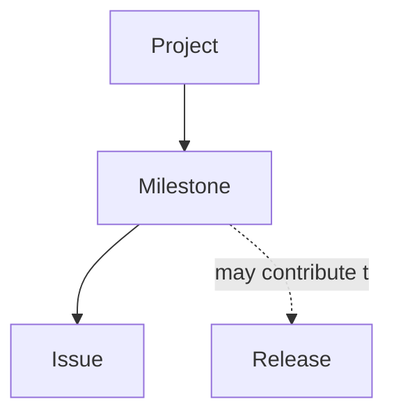

# Milestone

> [!abstract]
> **Milestone** — доменная сущность инженерной платформы Sun Decor, предназначенная для объединения нескольких Issue вокруг общей инженерной цели или контрольной точки проекта.
>
> Milestone определяет ожидаемый результат определённого этапа развития продукта и позволяет оценивать прогресс выполнения работ.
>
> В инженерной платформе Sun Decor Milestone рассматривается как инженерная контрольная точка, а не как статус задачи или календарный период.

---

# Purpose

Milestone существует для объединения связанных инженерных работ в логически завершённый этап.

Он позволяет:

- определить общую инженерную цель;
- объединить несколько Issue;
- отслеживать прогресс достижения цели;
- понимать степень готовности продукта;
- планировать последовательность развития продукта.

---

# Responsibilities

Milestone отвечает за:

- определение инженерной цели этапа;
- группировку связанных Issue;
- отслеживание прогресса выполнения;
- определение критериев достижения этапа;
- визуализацию готовности инженерной работы.

---

# Non-Responsibilities

Milestone **не отвечает** за:

- управление жизненным циклом задач;
- классификацию инженерной работы;
- определение приоритетов;
- хранение инженерной документации;
- выполнение инженерной работы.

Milestone определяет цель этапа, но не управляет её реализацией.

---

# Lifecycle

```text
Milestone Created
        ↓
Engineering Goal Defined
        ↓
Issues Added
        ↓
Progress Tracking
        ↓
Engineering Goal Achieved
        ↓
Milestone Closed
```

Milestone завершается после достижения инженерной цели, независимо от способа её реализации.

---

# Relationships



Milestone объединяет несколько Issue, относящихся к одной инженерной цели.

---

# Engineering Rules

## Goal Oriented

Каждый Milestone должен описывать инженерную цель, а не список работ.

---

## Multiple Issues

Один Milestone объединяет несколько связанных Issue.

Issue без Milestone допустимы, если работа является самостоятельной.

---

## Independent of Time

Milestone определяется достижением результата, а не календарной датой.

При необходимости дата может использоваться как ориентир, но не как критерий завершения.

---

## Measurable Outcome

Для каждого Milestone должен существовать измеримый критерий завершения.

---

## Product Evolution

Milestone отражает развитие продукта, а не организацию работы команды.

---

# Constraints

Milestone имеет следующие ограничения.

- Один Issue может относиться только к одному Milestone одновременно.
- Milestone не заменяет Project.
- Milestone не заменяет Release.
- Milestone не используется для классификации задач.
- Milestone не отражает состояние выполнения отдельных Issue.

---

# Best Practices

Рекомендуется:

- формулировать Milestone как достижимый инженерный результат;
- объединять только логически связанные Issue;
- использовать Milestone для крупных этапов развития продукта;
- закрывать Milestone сразу после достижения цели;
- не создавать избыточное количество Milestone.

---

# Engineering Examples

Примеры корректных Milestone:

- MVP опубликован
- Запуск корпоративного сайта
- GitHub Pages введён в эксплуатацию
- Первая публичная версия API
- Завершена инженерная платформа

Примеры некорректных Milestone:

- Задачи за июль
- Сделать сайт
- В процессе
- Срочно

---

# Architecture Notes

Milestone является механизмом планирования развития продукта.

Он объединяет инженерные работы вокруг общего результата, не вмешиваясь в управление жизненным циклом отдельных Issue.

Milestone позволяет оценивать готовность продукта по достигнутым инженерным целям, а не по количеству выполненных задач.

---

# Related Documents

## Overview

- [[GitHub Ecosystem]]

---

## Related Entities

- [[Project]]
- [[Issue]]
- [[Label]]
- [[Release]]

---

## Processes

- [[Engineering Workflow]]

---

## Architecture

- [[Engineering Platform Architecture]]
- [[Engineering Architecture Levels (EAL)]]

---

## Architecture Decision Records

- [[ADR-0014]]
- [[ADR-0015]]
- [[ADR-0016]]