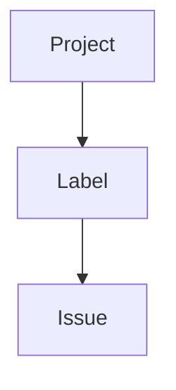

# Label

> [!abstract]
> **Label** — доменная сущность инженерной платформы Sun Decor, предназначенная для классификации инженерной работы по заранее определённым признакам.
>
> Label описывает свойства инженерной работы, но не изменяет её содержание, жизненный цикл или принадлежность.
>
> В инженерной платформе Sun Decor Label рассматривается как механизм семантической классификации инженерных сущностей.

---

# Purpose

Label существует для описания инженерной работы с помощью стандартизированных признаков.

Он позволяет:

- классифицировать инженерную работу;
- облегчать навигацию;
- выполнять фильтрацию;
- строить аналитические представления;
- автоматизировать процессы.

Label не влияет на выполнение работы, а лишь описывает её характеристики.

---

# Responsibilities

Label отвечает за:

- классификацию инженерной работы;
- описание инженерных свойств;
- поддержку фильтрации;
- поддержку автоматизации;
- обеспечение единообразной терминологии.

---

# Non-Responsibilities

Label **не отвечает** за:

- определение приоритета;
- управление жизненным циклом;
- назначение исполнителя;
- объединение задач;
- определение сроков;
- описание инженерного результата.

Label только классифицирует.

---

# Lifecycle

```text
Label Created
        ↓
Applied to Work Item
        ↓
Used for Search
        ↓
Used for Automation
        ↓
Removed (optional)
```

Жизненный цикл Label значительно превышает жизненный цикл отдельных Issue.

Один Label может использоваться многократно.

---

# Relationships



Label применяется к инженерной работе для её классификации.

---

# Engineering Rules

## Classification Only

Label используется исключительно для классификации инженерной работы.

---

## Standard Vocabulary

Набор Label определяется инженерной платформой и должен использовать единую терминологию.

Произвольное создание Label не рекомендуется.

---

## Reusable

Label должен использоваться повторно.

Создание одноразовых Label не допускается.

---

## Orthogonality

Каждый Label описывает только одно свойство.

Не допускается объединение нескольких характеристик в одном Label.

Например:

❌ `bug-high-priority`

Правильно:

- `type:bug`
- `priority:high`

---

## Machine Readable

Названия Label должны быть удобны как для людей, так и для автоматизации.

---

# Constraints

Label имеет следующие ограничения.

- Label не определяет порядок выполнения работы.
- Label не заменяет Milestone.
- Label не заменяет Status.
- Label не заменяет Project.
- Label может одновременно применяться к нескольким Issue.

---

# Label Taxonomy

В инженерной платформе Sun Decor рекомендуется использовать несколько независимых семейств Label.

| Семейство | Назначение | Примеры |
|-----------|------------|----------|
| `type:` | Тип инженерной работы | `type:feature`, `type:bug`, `type:documentation` |
| `priority:` | Приоритет | `priority:critical`, `priority:high`, `priority:normal`, `priority:low` |
| `area:` | Область продукта | `area:frontend`, `area:backend`, `area:github`, `area:architecture` |
| `status:` | Дополнительное состояние (при необходимости) | `status:blocked`, `status:needs-review` |
| `risk:` | Уровень инженерного риска | `risk:high`, `risk:medium`, `risk:low` |

Конкретный перечень Label определяется инженерными стандартами организации.

---

# Best Practices

Рекомендуется:

- использовать небольшое количество стандартизированных Label;
- регулярно проводить ревизию набора Label;
- применять единые правила именования;
- использовать префиксы (`type:`, `priority:`, `area:` и т.п.);
- избегать дублирующих Label;
- использовать Label для автоматизации и аналитики.

---

# Architecture Notes

Label является механизмом семантической классификации инженерной работы.

В отличие от Project, который организует выполнение работы, и Milestone, который определяет инженерную цель, Label описывает свойства инженерной работы.

Использование независимых семейств Label позволяет одновременно классифицировать работу по нескольким измерениям без нарушения принципа разделения ответственности.

---

# Related Documents

## Overview

- [[GitHub Ecosystem]]

---

## Related Entities

- [[Project]]
- [[Issue]]
- [[Milestone]]

---

## Processes

- [[Engineering Workflow]]

---

## Standards

- [[GitHub Label Standard]]

---

## Architecture

- [[Engineering Platform Architecture]]
- [[Engineering Architecture Levels (EAL)]]

---

## Architecture Decision Records

- [[ADR-0014]]
- [[ADR-0015]]
- [[ADR-0016]]