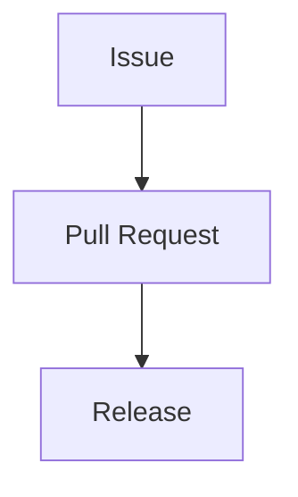

# Pull Request

> [!abstract]
> **Pull Request** — доменная сущность инженерной платформы Sun Decor, представляющая собой инженерную единицу поставки изменений.
>
> Pull Request объединяет реализованные изменения, обеспечивает их проверку и служит механизмом интеграции результатов инженерной работы в основной жизненный цикл продукта.
>
> В инженерной платформе Sun Decor Pull Request является обязательной точкой инженерной валидации перед публикацией изменений.

---

# Purpose

Pull Request существует для безопасной интеграции инженерных изменений.

Он позволяет:

- представить выполненную работу;
- провести инженерную проверку;
- обсудить реализацию;
- подтвердить соответствие инженерным стандартам;
- интегрировать изменения в продукт.

Pull Request завершает этап реализации и открывает путь к поставке результата.

---

# Responsibilities

Pull Request отвечает за:

- представление реализованных изменений;
- связь реализации с соответствующим Issue;
- проведение инженерной проверки;
- документирование замечаний;
- подтверждение готовности изменений;
- интеграцию изменений в основную ветку разработки.

---

# Non-Responsibilities

Pull Request **не отвечает** за:

- исследование проблемы;
- постановку инженерной работы;
- управление жизненным циклом задач;
- публикацию релизов;
- управление проектом.

Pull Request проверяет изменения, но не определяет необходимость их выполнения.

---

# Lifecycle

```text
Issue Completed
        ↓
Pull Request Created
        ↓
Validation
        ↓
Review
        ↓
Requested Changes (optional)
        ↓
Approval
        ↓
Merge
        ↓
Ready for Release
```

Pull Request завершается после успешной интеграции изменений.

---

# Relationships



Pull Request связывает инженерную работу с поставкой результата.

---

# Engineering Rules

## Issue First

Каждый Pull Request должен быть связан хотя бы с одним Issue.

Изменения без предварительно созданного Issue не рекомендуются.

---

## One Engineering Change

Каждый Pull Request должен представлять одно логически завершённое изменение.

Если изменение затрагивает несколько независимых инженерных целей, рекомендуется разделить его на несколько Pull Request.

---

## Review Before Merge

Pull Request должен пройти инженерную проверку до объединения изменений.

Проверка может включать:

- соответствие архитектуре;
- соответствие инженерным стандартам;
- проверку документации;
- проверку автоматических тестов;
- анализ замечаний.

---

## Traceability

Pull Request должен обеспечивать прослеживаемость инженерной работы.

Рекомендуется наличие ссылок на:

- Issue;
- Discussion;
- ADR (при необходимости);
- связанную документацию.

---

## Merge as Integration

Объединение Pull Request означает принятие изменений в основной жизненный цикл продукта.

Merge не означает публикацию релиза.

---

# Constraints

Pull Request имеет следующие ограничения.

- Pull Request не заменяет Issue.
- Pull Request не заменяет Code Review.
- Pull Request не заменяет Release.
- Один Pull Request может реализовывать один или несколько тесно связанных Issue.
- Один Issue может быть реализован несколькими Pull Request, если работа выполняется поэтапно.

---

# Best Practices

Рекомендуется:

- создавать небольшие Pull Request;
- ограничивать Pull Request одной инженерной целью;
- сопровождать изменения описанием выполненной работы;
- использовать ссылки на связанные Issue;
- обеспечивать успешное прохождение автоматических проверок до Merge;
- устранять замечания Review до повторной проверки.

---

# Pull Request Structure

Каждый Pull Request рекомендуется оформлять по следующей структуре.

| Раздел | Назначение |
|---------|------------|
| Summary | Краткое описание изменений |
| Related Issue | Ссылка на связанный Issue |
| Motivation | Причина внесения изменений |
| Scope | Что изменено |
| Validation | Как проверена реализация |
| References | Связанные документы |

---

# Architecture Notes

Pull Request является механизмом инженерной интеграции изменений.

Он отделяет этап реализации от этапа поставки, обеспечивая контроль качества, прослеживаемость и соответствие инженерным стандартам.

В инженерной платформе Sun Decor Pull Request рассматривается как обязательная точка проверки перед включением изменений в продукт.

---

# Related Documents

## Overview

- [[GitHub Ecosystem]]

---

## Related Entities

- [[Repository]]
- [[Discussion]]
- [[Issue]]
- [[Project]]
- [[Milestone]]
- [[Label]]
- [[Release]]

---

## Processes

- [[Engineering Workflow]]

---

## Standards

- [[Pull Request Standard]]

---

## Architecture

- [[Engineering Platform Architecture]]
- [[Engineering Architecture Levels (EAL)]]

---

## Architecture Decision Records

- [[ADR-0014]]
- [[ADR-0015]]
- [[ADR-0016]]