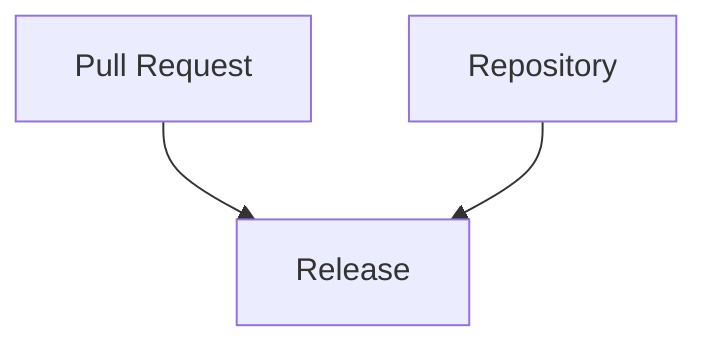

# Release

> [!abstract]
> **Release** — доменная сущность инженерной платформы Sun Decor, представляющая собой официальную публикацию инженерного результата.
>
> Release завершает цикл реализации изменений и делает утверждённую версию продукта доступной для использования.
>
> В инженерной платформе Sun Decor Release рассматривается как событие поставки (Delivery Event), а не как техническая операция создания версии.

---

# Purpose

Release существует для официальной публикации результатов инженерной работы.

Он позволяет:

- определить опубликованную версию продукта;
- зафиксировать состав поставки;
- документировать изменения;
- обеспечить воспроизводимость опубликованного результата;
- предоставить пользователям стабильную версию продукта.

Release является границей между инженерной разработкой и эксплуатацией продукта.

---

# Responsibilities

Release отвечает за:

- публикацию инженерного результата;
- фиксацию версии продукта;
- документирование состава поставки;
- публикацию Release Notes;
- обеспечение возможности воспроизведения опубликованной версии;
- поддержку истории поставок.

---

# Non-Responsibilities

Release **не отвечает** за:

- разработку функциональности;
- проведение инженерной проверки;
- управление инженерной работой;
- принятие архитектурных решений;
- выполнение автоматизации сборки.

Release публикует результат, но не создаёт его.

---

# Lifecycle

```text
Pull Request Merged
        ↓
Release Prepared
        ↓
Version Assigned
        ↓
Release Notes Created
        ↓
Publication
        ↓
Available to Users
```

Release завершает инженерный цикл изменений.

---

# Relationships



Release публикует изменения, интегрированные в Repository посредством Pull Request.

---

# Engineering Rules

## Merge Before Release

Release создаётся только после успешной интеграции всех необходимых Pull Request.

---

## Immutable Release

После публикации Release не изменяется.

Любые последующие изменения оформляются новым Release.

---

## Versioned Delivery

Каждый Release должен иметь уникальную версию.

Стратегия версионирования определяется инженерными стандартами организации.

---

## Release Notes Required

Каждый Release сопровождается описанием опубликованных изменений.

Release Notes являются обязательной частью поставки.

---

## Reproducibility

Опубликованный Release должен позволять воспроизвести соответствующее состояние продукта.

---

# Constraints

Release имеет следующие ограничения.

- Один Release относится к одному Repository.
- Один Pull Request может входить только в опубликованные Release после Merge.
- Release не заменяет Git Tag.
- Release не заменяет Deployment.
- Release не определяет жизненный цикл инженерной работы.

---

# Best Practices

Рекомендуется:

- использовать семантическое версионирование;
- публиковать Release только после завершения проверки изменений;
- автоматически формировать Release Notes при возможности;
- сопровождать Release ссылками на связанные Issue и Pull Request;
- хранить полную историю опубликованных версий.

---

# Release Structure

Каждый Release рекомендуется оформлять по следующей структуре.

| Раздел | Назначение |
|---------|------------|
| Version | Версия продукта |
| Summary | Краткое описание релиза |
| Changes | Основные изменения |
| Related Issues | Связанные Issue |
| Related Pull Requests | Связанные Pull Request |
| Release Notes | Подробное описание изменений |

---

# Architecture Notes

Release является точкой поставки инженерного результата.

Он отделяет внутренний инженерный процесс от опубликованной версии продукта, обеспечивая прослеживаемость, воспроизводимость и прозрачность истории изменений.

В инженерной платформе Sun Decor Release рассматривается как официальное событие публикации, независимо от способа доставки продукта пользователю.

---

# Related Documents

## Overview

- [[GitHub Ecosystem]]

---

## Related Entities

- [[Repository]]
- [[Issue]]
- [[Pull Request]]
- [[GitHub Actions]]

---

## Processes

- [[Engineering Workflow]]

---

## Standards

- [[Release Standard]]

---

## Architecture

- [[Engineering Platform Architecture]]
- [[Engineering Architecture Levels (EAL)]]

---

## Architecture Decision Records

- [[ADR-0014]]
- [[ADR-0015]]
- [[ADR-0016]]