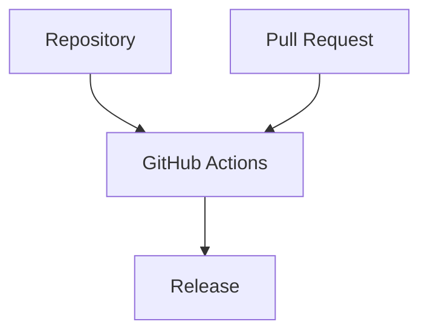

# GitHub Actions

> [!abstract]
> **GitHub Actions** — доменная сущность инженерной платформы Sun Decor, предназначенная для автоматизации инженерных процессов.
>
> GitHub Actions обеспечивает выполнение повторяемых операций по заранее определённым правилам, снижая количество ручной работы и повышая воспроизводимость инженерной деятельности.
>
> В инженерной платформе Sun Decor GitHub Actions рассматривается как механизм реализации инженерной автоматизации, а не исключительно как средство CI/CD.

---

# Purpose

GitHub Actions существует для автоматизации повторяемых инженерных процессов.

Он позволяет:

- автоматически выполнять инженерные проверки;
- запускать сборку продукта;
- публиковать результаты;
- поддерживать инженерные стандарты;
- синхронизировать инженерные артефакты;
- уменьшать влияние человеческого фактора.

Automation должна повышать качество инженерной деятельности, а не заменять инженерные решения.

---

# Responsibilities

GitHub Actions отвечает за:

- автоматическое выполнение инженерных процессов;
- выполнение Workflow;
- проверку инженерных артефактов;
- автоматическую сборку;
- автоматическую публикацию;
- выполнение повторяемых операций;
- интеграцию инженерных инструментов.

---

# Non-Responsibilities

GitHub Actions **не отвечает** за:

- принятие инженерных решений;
- управление архитектурой;
- постановку инженерной работы;
- проведение инженерных обсуждений;
- замену инженерной проверки.

GitHub Actions автоматизирует процессы, но не принимает инженерных решений.

---

# Lifecycle

```text
Event
        ↓
Workflow Triggered
        ↓
Jobs Executed
        ↓
Validation
        ↓
Success / Failure
        ↓
Artifacts Published (optional)
```

Каждый Workflow запускается в ответ на определённое событие и завершается документированным результатом.

---

# Relationships



GitHub Actions автоматизирует инженерные процессы, связанные с жизненным циклом продукта.

---

# Engineering Rules

## Automation Supports Engineering

Автоматизация должна поддерживать инженерные процессы, но не заменять инженерную экспертизу.

---

## Deterministic Execution

Workflow должен давать воспроизводимый результат при одинаковых входных данных.

---

## Small and Focused

Каждый Workflow рекомендуется проектировать для одной инженерной цели.

Не рекомендуется объединять большое количество независимых процессов в одном Workflow.

---

## Infrastructure as Code

Все Workflow должны храниться в репозитории продукта и сопровождаться системой контроля версий.

---

## Fail Fast

При обнаружении ошибки Workflow должен завершаться как можно раньше, предотвращая распространение некорректных изменений.

---

# Constraints

GitHub Actions имеет следующие ограничения.

- Workflow не должен принимать архитектурные решения.
- Workflow не заменяет Pull Request Review.
- Workflow не заменяет инженерное тестирование.
- Workflow не должен зависеть от ручных действий без явной необходимости.
- Автоматизация должна быть воспроизводимой и документированной.

---

# Best Practices

Рекомендуется:

- разделять Workflow по инженерным задачам;
- использовать повторно применимые действия (Reusable Workflows и Composite Actions) при наличии общего поведения;
- минимизировать время выполнения Workflow;
- явно документировать назначение каждого Workflow;
- хранить конфиденциальные данные только в GitHub Secrets;
- регулярно пересматривать и упрощать автоматизацию.

---

# Typical Engineering Processes

GitHub Actions может автоматизировать:

| Процесс | Пример |
|----------|---------|
| Validation | Проверка документации, ссылок, форматирования |
| Build | Сборка продукта |
| Test | Запуск автоматических тестов |
| Quality | Статический анализ, линтеры, проверки качества |
| Security | Проверка зависимостей и секретов |
| Release | Подготовка и публикация релиза |
| Deployment | Публикация продукта (например, GitHub Pages) |
| Maintenance | Плановые инженерные задачи |

---

# Architecture Notes

GitHub Actions является механизмом автоматизации инженерной платформы.

Он реализует инженерные процессы, определённые организацией, обеспечивая воспроизводимость, прозрачность и масштабируемость разработки.

Автоматизация рассматривается как средство повышения качества инженерной деятельности, а не как самостоятельная цель.

---

# Related Documents

## Overview

- [[GitHub Ecosystem]]

---

## Related Entities

- [[Repository]]
- [[Project]]
- [[Pull Request]]
- [[Release]]

---

## Processes

- [[Engineering Workflow]]

---

## Standards

- [[GitHub Actions Standard]]
- [[CI-CD Standard]]

---

## Architecture

- [[Engineering Platform Architecture]]
- [[Engineering Architecture Levels (EAL)]]

---

## Architecture Decision Records

- [[ADR-0014]]
- [[ADR-0015]]
- [[ADR-0016]]