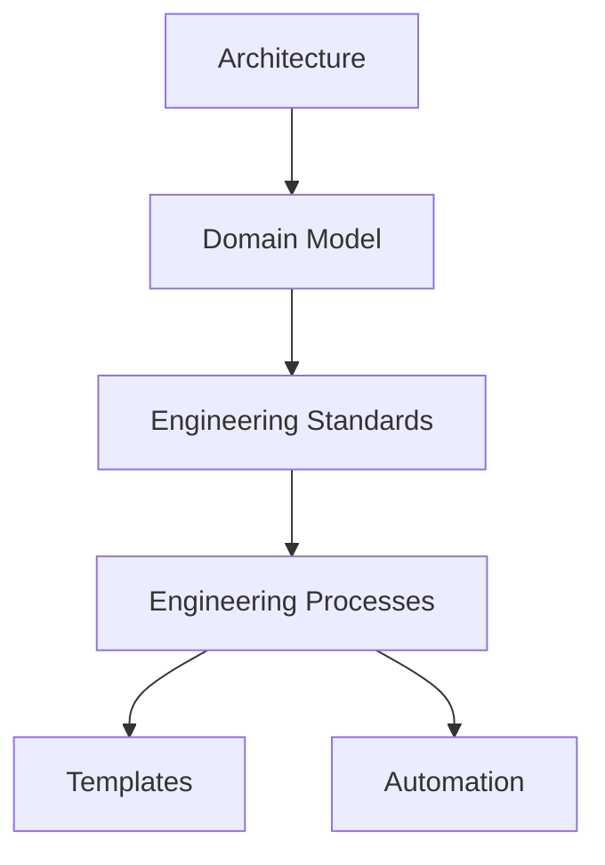

# Engineering Standards

> [!abstract]
> **Engineering Standards** — слой инженерной архитектуры Sun Decor, определяющий обязательные правила использования инженерных сущностей, процессов и инструментов.
>
> Стандарты обеспечивают единообразие инженерной деятельности, уменьшают неоднозначность при принятии решений и формируют единый подход к разработке во всех продуктах организации.
>
> В инженерной платформе Sun Decor Standards являются связующим звеном между доменной моделью и инженерными процессами.

---

# Purpose

Слой Engineering Standards существует для формализации инженерных соглашений организации.

Он отвечает на вопрос:

> **«Как именно мы работаем?»**

Если архитектура определяет устройство инженерной платформы, а доменная модель описывает её сущности, то стандарты определяют единые правила их применения.

---

# Position in Engineering Architecture

Согласно [[Engineering Architecture Levels (EAL)]], Standards располагаются между доменной моделью и инженерными процессами.

```text
Vision
        ↓

Architecture
        ↓

Domain Model
        ↓

Engineering Standards
        ↓

Engineering Processes
        ↓

Templates
        ↓

Automation
        ↓

Products
```

Стандарты являются нормативной основой для процессов и автоматизации.

---

# Responsibilities

Engineering Standards отвечают за:

- определение обязательных инженерных правил;
- унификацию использования инженерных сущностей;
- снижение неоднозначности при разработке;
- поддержку качества инженерной деятельности;
- обеспечение масштабируемости организации;
- формирование единых практик разработки.

---

# Non-Responsibilities

Engineering Standards **не отвечают** за:

- описание архитектуры организации;
- определение доменных сущностей;
- последовательность инженерных процессов;
- шаблоны документов;
- автоматизацию процессов;
- реализацию программного обеспечения.

Эти обязанности принадлежат соответствующим архитектурным слоям.

---

# Standard Hierarchy

Каждый стандарт описывает одну инженерную область ответственности.

```text
Engineering Standards
│
├── Repository Standard
├── Issue Standard
├── Discussion Standard
├── Project Standard
├── Milestone Standard
├── GitHub Label Standard
├── Pull Request Standard
├── Release Standard
├── GitHub Actions Standard
├── Branch Strategy
├── Commit Message Convention
├── Definition of Ready
└── Definition of Done
```

Стандарты являются независимыми документами и могут развиваться отдельно друг от друга.

---

# Design Principles

Каждый инженерный стандарт должен соответствовать следующим принципам.

## Single Responsibility

Один стандарт описывает одну инженерную область.

---

## Organization-wide Applicability

Стандарт применяется ко всем продуктам организации, если явно не указано иное.

---

## Technology Independence

Стандарт определяет инженерные правила, а не особенности конкретного инструмента или технологии.

---

## Consistency

Стандарты не должны противоречить друг другу.

---

## Traceability

Каждый стандарт должен иметь прослеживаемую связь с архитектурой, доменной моделью и инженерными процессами.

---

## Evolvability

Стандарты должны развиваться эволюционно без нарушения уже принятых архитектурных решений.

---

# Relationship with Other Layers



Engineering Standards связывают архитектурную модель с практической инженерной деятельностью.

---

# Engineering Standard Structure

Каждый стандарт рекомендуется оформлять по единой структуре.

| Раздел | Назначение |
|---------|------------|
| Purpose | Назначение стандарта |
| Scope | Область применения |
| Rules | Обязательные правила |
| Recommendations | Рекомендуемые практики |
| Exceptions | Допустимые исключения |
| Rationale | Обоснование правил |
| Related Documents | Связанные документы |

Единая структура обеспечивает предсказуемость и удобство использования инженерной документации.

---

# Architecture Notes

Engineering Standards являются нормативным уровнем инженерной платформы Sun Decor.

Они преобразуют архитектурные решения и доменную модель в конкретные правила, обязательные для применения при разработке всех продуктов организации.

Именно стандарты обеспечивают единообразие инженерной практики и служат основой для построения инженерных процессов, шаблонов и автоматизации.

---

# Related Documents

## Architecture

- [[Engineering Platform Architecture]]
- [[Engineering Architecture Levels (EAL)]]

---

## Domain Model

- [[GitHub Ecosystem]]

---

## Processes

- [[Engineering Workflow]]

---

## Templates

- [[Standard Template]]

---

## Architecture Decision Records

- [[ADR-0014]]
- [[ADR-0015]]